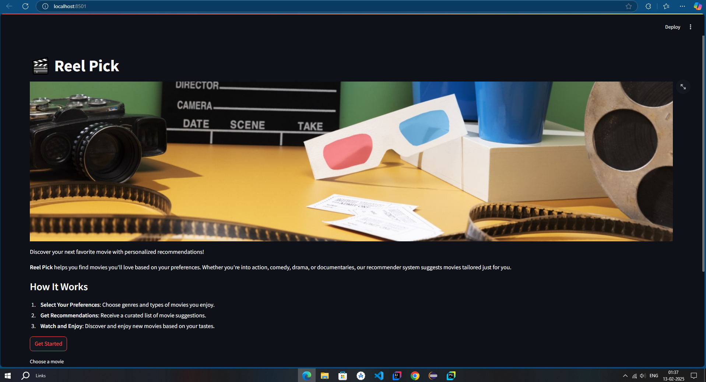
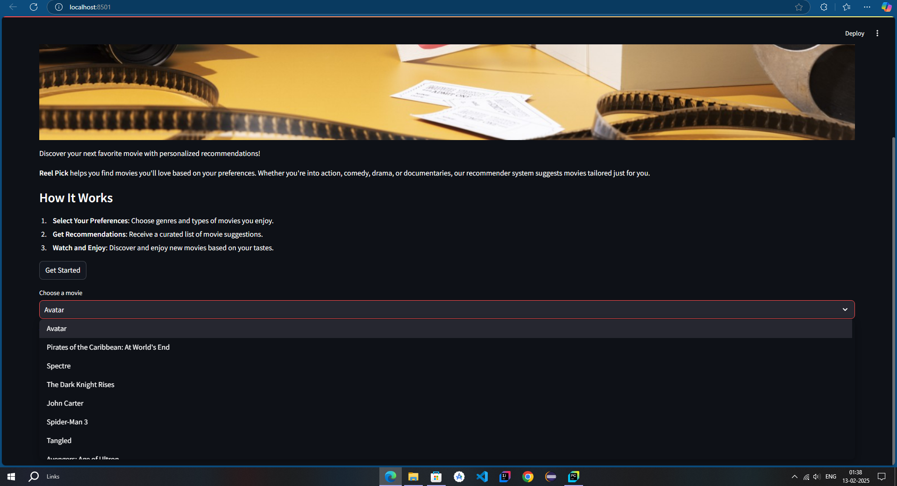
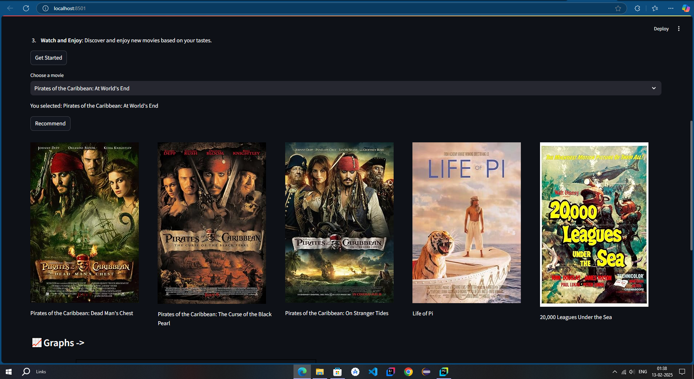
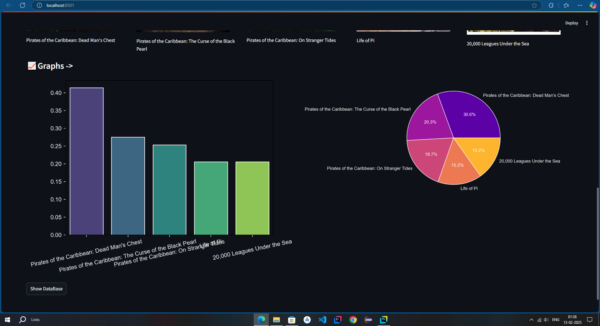
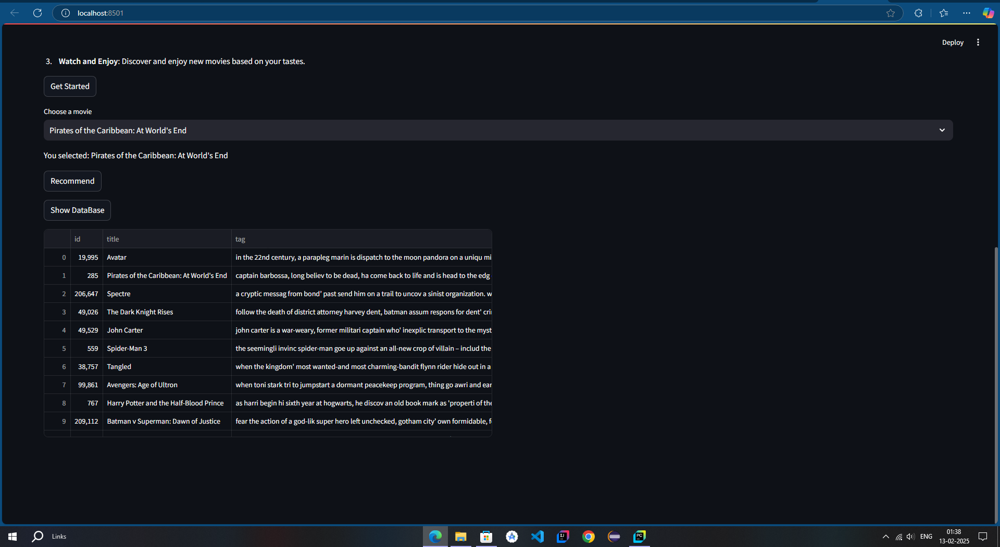

# Reel Pick - Movie Recommender App

## Overview


**Reel Pick** is an innovative movie recommendation app designed to help users discover films they will love. By leveraging advanced **Natural Language Processing (NLP)** and **Machine Learning** algorithms, Reel Pick delivers personalized movie suggestions based on your preferences. Simply select your favorite genres, types of movies, and let the app do the rest by predicting similar movies you'll enjoy.

---

## Features

### 1. **Select Your Preferences**

   - Choose from a wide range of genres such as **Action**, **Drama**, **Comedy**, **Sci-Fi**, **Romance**, and more.
   - Specify the types of movies you enjoy, including themes like **"Thriller,"** **"Family-friendly,"** **"Indie,"** and **"Blockbusters."**

### 2. **Get Personalized Recommendations**

   - Once you’ve selected your preferences, Reel Pick generates a tailored list of movie suggestions.
   - Recommendations are based on your selections as well as data collected from similar users, ensuring high-quality suggestions.
   - Database is taked from tmdb with over 5000 movies

### 3. **Powered by NLP & Machine Learning**

   - The app uses **Natural Language Processing (NLP)** to analyze movie descriptions, plotlines, and metadata.
   - Concept of vectorization is used to map movies to recommendations and the resultants are filtered out.
   - **Machine Learning** models predict movies similar to those you've enjoyed in the past, making each recommendation increasingly accurate over time.


---

## How It Works

1. **Choose Your Preferences:**
   - Start by selecting your favorite genres, preferred movie types, and other preferences.
   
2. **Generate Recommendations:**
   - Reel Pick processes your selections and presents a list of curated movies.

3. **Refined Suggestions:**
   - The app uses NLP to better understand the content of movies and Machine Learning to match films with your preferences.
   
4. **Enjoy Your Movie Night:**
   - Based on the predictions, you'll have a fresh list of movies to pick from for your next movie marathon.

---


## Installation

### 1. Clone this repository to your local machine:
```bash
git clone https://github.com/yourusername/ReelPick.git
